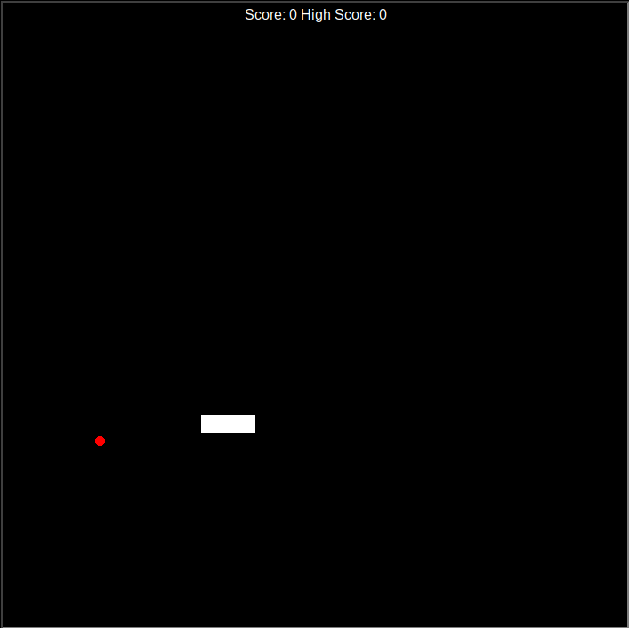

# Persistent Snake Game (Python & Turtle)

An object-oriented implementation of the classic Snake arcade game built with Python's `turtle` graphics library. This version includes persistent data storage, saving the player's all-time high score to a local file so record tracking persists across game restarts.

    
## Key Features
- **Persistent High Score:** Uses local file read/write operations to load and update the all-time high score across independent sessions.
- **Dynamic Food Spawning:** Generates target objects at randomized coordinate points on the canvas.
- **Growing Body Mechanics:** Dynamically lengthens the snake upon eating food.
- **Collision Detection:** Continuous hit-box checking for wall boundaries and self-intersection.

## Controls

| Action | Key |
| :--- | :--- |
| **Move Up** | `Up Arrow`|
| **Move Down** | `Down Arrow`|
| **Move Left** | `Left Arrow`|
| **Move Right** | `Right Arrow`|

## Computer Science Concepts Applied
- **File Handling & Data Persistence:** Leveraged Python's built-in File I/O (`open()`, `read()`, `write()`) to maintain application state across program lifecycles.
- **Object-Oriented Design (OOP):** Decoupled the project into distinct classes (`Snake`, `Food`, `Score`) to enforce single-responsibility principles.

### Prerequisites
- Python 3.x (Includes the standard `turtle` library)
